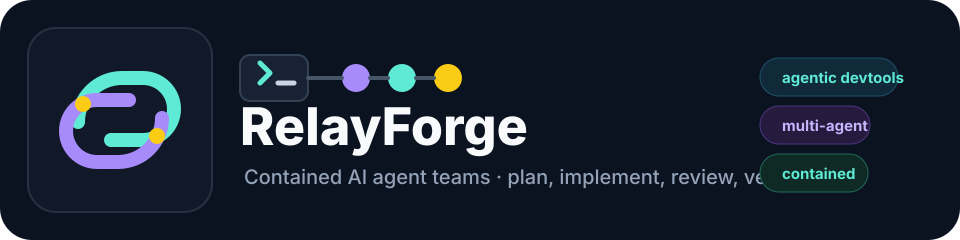
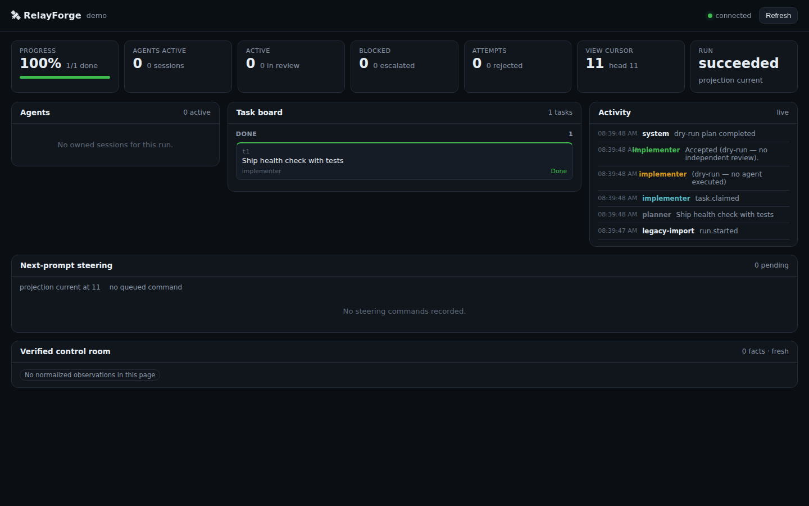
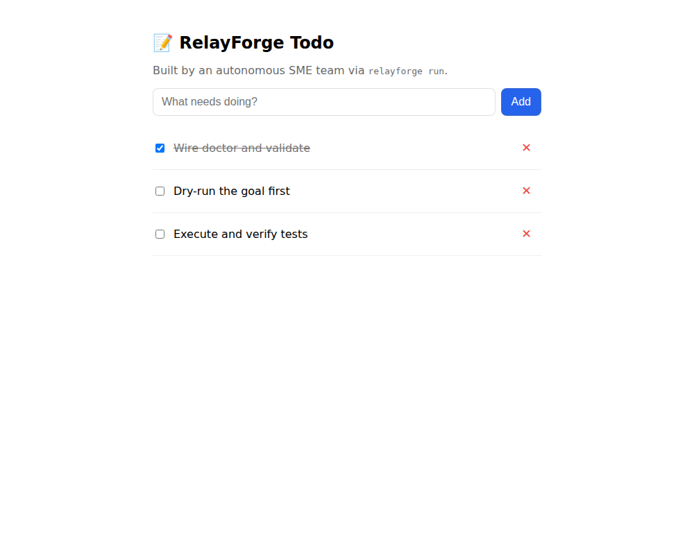

# RelayForge

<p align="center">
  
</p>

<p align="center">
  <b>Safe multi-agent coding loops</b> — plan → implement → review → verify,<br/>
  each step in an isolated git worktree with real OS containment.
</p>

<p align="center">
  <a href="https://github.com/arbazkhan971/relayforge/actions/workflows/ci.yml"></a>
  
  
  
</p>

```bash
# Install the current build directly from GitHub (npm registry release is pending)
npm install -g github:arbazkhan971/relayforge

cd /path/to/your-git-project   # must be a clean git repo for --execute
relayforge setup --provider codex   # or: claude | gemini
relayforge run "Ship a small verified change"            # dry-run (default)
relayforge run "Ship a small verified change" --execute  # actually launch agents
```

`setup` initializes the project when needed, detects its real name and build/test
commands, writes project intelligence for the agents, validates the config, and
separately reports whether safe planning and full coding execution are ready.

---

## Why RelayForge

Most “agent team” tools are shell scripts around chat CLIs. RelayForge is a **parent-owned control plane**:

| Guarantee | What it means |
| --- | --- |
| Dry-run by default | Nothing spends tokens until you pass `--execute` |
| Isolated worktrees | Each attempt gets its own git worktree; review is a separate boundary |
| Containment | Linux Bubblewrap + cgroup scopes; fail closed if the host can’t prove them |
| Durable state | Run facts live in SQLite under `.loop/` — restartable, auditable |
| Independent review | Reviewer role is not the same process as the implementer |
| Deterministic verify | Your `verify:` commands (e.g. `npm test`) gate acceptance |

---

## Setup

The npm registry release is still gated, but the current build installs directly
from GitHub.

### 1. Prerequisites

- **Node.js** 20.x or ≥22  
- **Git**  
- At least one agent CLI you use day-to-day: **`claude`**, **`codex`**, or **`gemini`**  
- A C/C++ build toolchain and Python if npm needs to compile the SQLite binding
  (`build-essential python3` on Ubuntu/Debian)
- **Linux** recommended for full safety (Bubblewrap + user cgroup). macOS works
  with weaker containment: **dry-run plans, `doctor`, `serve` (dashboard) and
  the CLI all work on macOS** — only `--execute` still fails closed there,
  because the money ledger needs `/proc/self/fd` and agent processes need a
  cgroup-v2 strong scope (Linux provides both). Plan on macOS, execute on a
  Linux box (see `docs/linux-runner-runbook.md`).

```bash
node -v && git --version
command -v claude || command -v codex || command -v gemini
```

### 2. Install RelayForge on your PATH

```bash
npm install -g github:arbazkhan971/relayforge
relayforge --version
```

To work on RelayForge itself instead, clone this repository and run
`npm ci && npm run build && npm link`.

### 3. Init a project

```bash
cd /path/to/your-app
git status         # should be clean before --execute

relayforge setup --provider claude  # or: codex | gemini
```

`setup` gives two explicit results: safe planning readiness and coding-execution
readiness. Fix each execution blocker it prints before adding `--execute`. On
Linux you want Bubblewrap, a delegated cgroup v2 scope, and at least one ready
provider. See the [laptop/VM quickstart](docs/laptop-vm-quickstart.md) for the
short Ubuntu path.

### 4. First run

```bash
# Plan only — no agents launched
relayforge run "Add a /health endpoint and a unit test"

# When the plan looks right, spend tokens
relayforge run "Add a /health endpoint and a unit test" --execute
```

### 5. Watch the run

Every `--execute` run opens its own detached tmux viewport by default (disable
with `defaults.viewport: false` or `RELAYFORGE_TMUX=off`); the commands below
just attach to or show it.

```bash
# Local dashboard + read-only API (loopback only)
relayforge serve

# tmux panes for agent sessions (on by default for execute runs)
relayforge monitor            # single-screen mission control (latest run)
relayforge attach             # attach to the latest run's viewport
relayforge tmux new           # open the viewport explicitly
```

---

## Daily commands

```text
relayforge doctor              # is this machine / project ready?
relayforge setup               # initialize/check onboarding; safe to rerun
relayforge validate            # config schema + semantics
relayforge run "<goal>"        # dry-run plan
relayforge run "<goal>" --execute
relayforge serve               # dashboard on 127.0.0.1
relayforge status              # owned sessions
relayforge logs <owned-tmux-session> --lines 160
relayforge stop <run-id>       # cancel a run
relayforge --help
```

---

## Providers that work today

| Type | CLI on PATH | Notes |
| --- | --- | --- |
| `claude` | `claude` | Best default for most people |
| `codex` | `codex` | ChatGPT / Codex login |
| `gemini` | `gemini` | Gemini CLI auth |
| `custom` | your binary | You own the contract |
| `opencode` / `pi` / `grok` | exact pins | **Personal subscription (CLI login) or linked API key required**; execute refuses only when nothing is linked |

OpenCode / Pi / Grok run on their own contained routes once you link a credential:
install + log into the CLI (personal subscription) or set the matching API key.
Release receipts for npm publication are a separate operator gate.

---

## What you get after `setup`

- `relayforge.config.yaml` — strict team / loop / verify config  
- `brief.md` — project brief for agents  
- `PROJECT-INTELLIGENCE.md` — detected stack and authoritative build/test commands
- `.loop/` — durable runs, prompts, locks (do not rename)  

Compatibility: existing `loop.config.yaml` and `.loop/` still work. Binary aliases `loop` and `loop-orchestrator` call the same program as `relayforge`.

---

## Screenshots (live product)

Captured from a **running** `relayforge serve` after a real dry-run (connected control plane, task board, activity), and from the shipped example app.

### Control dashboard — connected after dry-run

<p align="center">
  
</p>

Shows: green **connected** state, KPI strip (progress 100%, run **succeeded**), task board with the planned task in **DONE**, and a live activity timeline.

### Example app — `examples/todo-app`

<p align="center">
  
</p>

```bash
cd examples/todo-app && npm start   # http://localhost:3000
```

---

## Docs

| Doc | For |
| --- | --- |
| [Laptop/VM quickstart](docs/laptop-vm-quickstart.md) | Fastest supported path from install to a coding run |
| [Configuration](docs/configuration.md) | Full config reference |
| [Safety](docs/safety.md) | Containment and fail-closed rules |
| [Session steering](docs/session-steering.md) | Future-boundary steering (not terminal injection) |
| [Architecture](docs/architecture.md) | How the control plane works |
| [Implementation status](docs/implementation-status.md) | What’s green vs release-blocked |
| [Publishing](docs/publishing.md) | RC / npm gates (operators) |

---

## Current boundaries (honest)

- **Single-repo loops** with Claude/Codex/Gemini are the supported product path.  
- **Multi-repo** is integrated but needs explicit config.  
- **OpenCode / Pi / Grok** characterization exists; ordinary execute is credential-gated (linked subscription or API key), and release receipts still gate npm publish.  
- **Not on npm yet** — install from this GitHub repo until `1.0.0-rc.1` is published.  
- No auto-merge to `main`, no invented remote PRs without explicit SCM config.

---

## License

MIT — see [LICENSE](LICENSE).

<p align="center">
  <br/>
  <sub>github.com/arbazkhan971/relayforge</sub>
</p>
